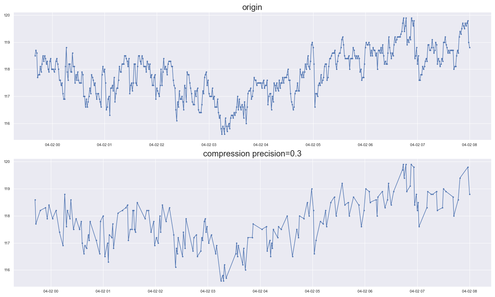
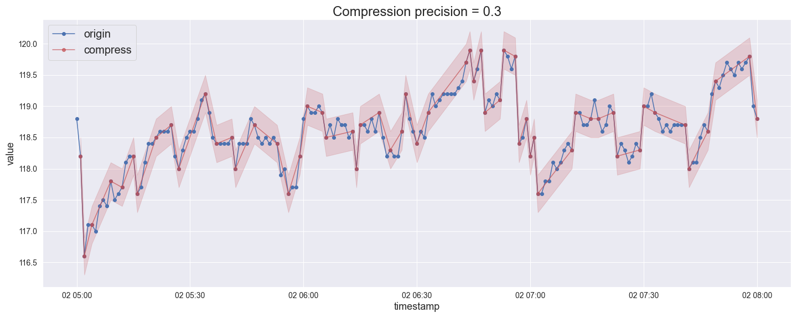
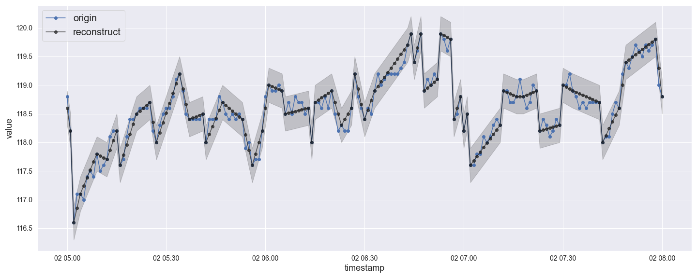

# Python Integration for Storage-efficient Database Usage

Integration of MySQL Connector/Python to save time series data in a storage-efficient way by applying lossy compression and reconstructing data with user-defined precision.

## Motivation

- Reduction of data stored in the remote server
- Reduced transmission between server to avoid network congestion
- Reconstruction of queried data with little information loss

## Usage

The usage of this module is almost the same as MySQL Connector/Python except CREATE TABLE.

More details and analysis can be found in `example.ipynb`.

```python
import connector

# Connect to server
ourdb = connector.connect(
    host=your_host,
    port=port_number,
    user=user_name,
    password=password)

# Get a cursor
ourcursor = cnx.cursor()

# Create and use database
ourcursor.execute('CREATE DATABASE AMPds')
ourcursor.execute('USE AMPds;')

# Execute a query
ourcursor.execute("YOUR QUERY STATEMENT")

# Close connection
ourdb.close()
```

### CREATE TABLE

User can specify precision when creating table by adding `dev_margin` to the CREATE TABLE SQL statement.

```python
stmt_create_table = (
    "CREATE TABLE voltage ("
    "  id int NOT NULL AUTO_INCREMENT PRIMARY KEY,"
    "  timestamp DATETIME,"
    "  value DOUBLE,"
    "  dev_margin=0.3"
    ");"
)
ourcursor.execute(stmt_create_table)
```

### INSERT, SELECT and FETCH

INSERT, SELECT and FETCH statement are the same as original MySQL statement. The connector will check the incoming data and decide whether to save previous data point when INSERT, and reconstruct data when SELECT with user-defined precision specified when CREATE TABLE.

#### INSERT

```python
# Insert the first 10000 rows into table
num_insert = 10000
for _, v_row in df_yourfile[:num_insert].iterrows():
    v_timestamp = v_row['timestamp'].strftime('%Y-%m-%d %H:%M:%S')
    v_value = v_row['V']
    stmt_insert = ("INSERT INTO voltage (timestamp, value) VALUES "
                   f"('{v_timestamp}', {v_value});")
    ourcursor.execute(stmt_insert)
ourdb.commit()
```

#### SELECT

```python
# Select data in a time range
start_idx, end_idx = 500, 7000
start_time = df_yourfile.loc[start_idx, 'timestamp'].strftime('%Y-%m-%d %H:%M:%S')
end_time = df_yourfile.loc[end_idx, 'timestamp'].strftime('%Y-%m-%d %H:%M:%S')

stmt_select = (
    f"SELECT timestamp, value FROM voltage\n"
    f"WHERE timestamp >= '{start_time}'\n"
    f"AND timestamp <= '{end_time}';"
)
ourcursor.execute(stmt_select)
```

#### FETCH

```python
data_reconstruct = ourcursor.fetchall()
```

## Compression algorithm

We implement the compression algorithm used in OSIsoft Pi system. More details can be found at [OSIsoft: Exception and Compression Full Details](https://www.youtube.com/watch?v=89hg2mme7S0).

## Result

Test on the voltage field of Electricity_B1E meter in the AMPds2 dataset .



Compression



Reconstruction



Compression ratio

| precision | ratio |
| --------- | :---- |
| 0.15      | 1.06  |
| 0.2       | 2.02  |
| 0.25      | 2.45  |
| 0.3       | 2.87  |
| 0.5       | 5.49  |
| 0.75      | 10.21 |

## Currently not support

- Custom column names for compression table. Column names are fixed to `timestamp` and `value` currently.
- `>` and `<` . These two comparison symbols will be converted to `<=` and `>=`.
- Query with parameters
- Insert multiple rows at one time

- Select on `value`
- Nested select statement

## Reference

- [MySQL Connector/Python](https://github.com/mysql/mysql-connector-python)
- [OSIsoft: Exception and Compression Full Details](https://www.youtube.com/watch?v=89hg2mme7S0)
- [AMPds2: The Almanac of Minutely Power dataset, Harvard Dataverse](https://dataverse.harvard.edu/dataset.xhtml?persistentId=doi:10.7910/DVN/FIE0S4)